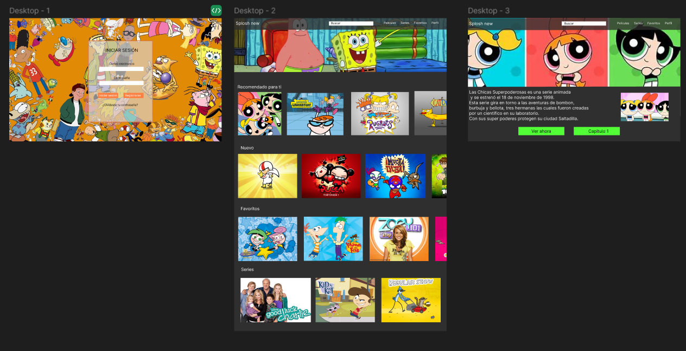
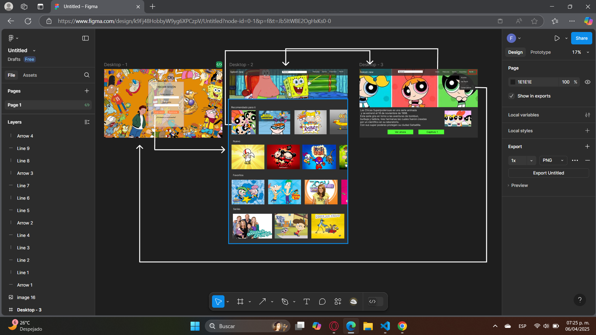
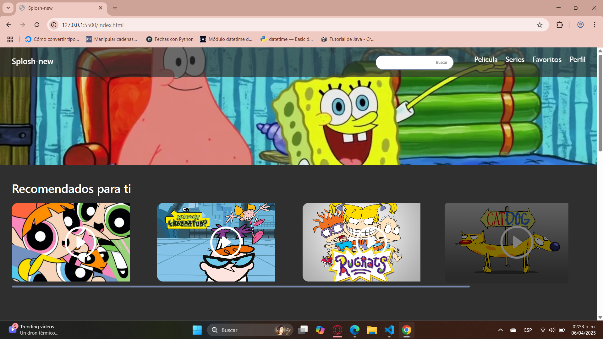
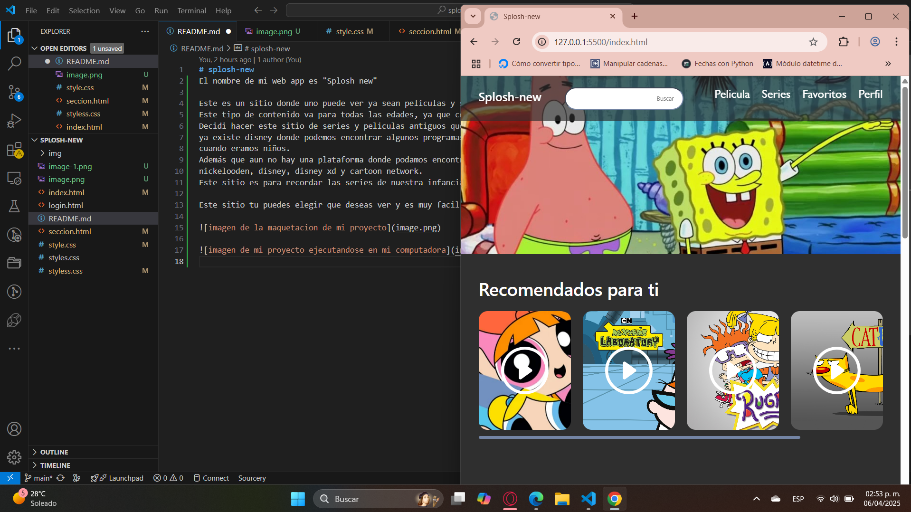
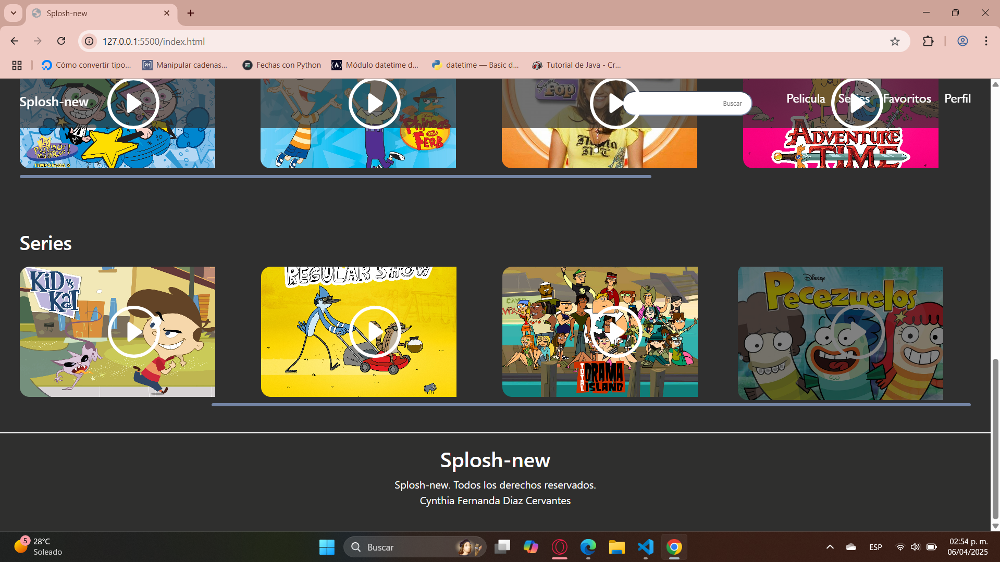
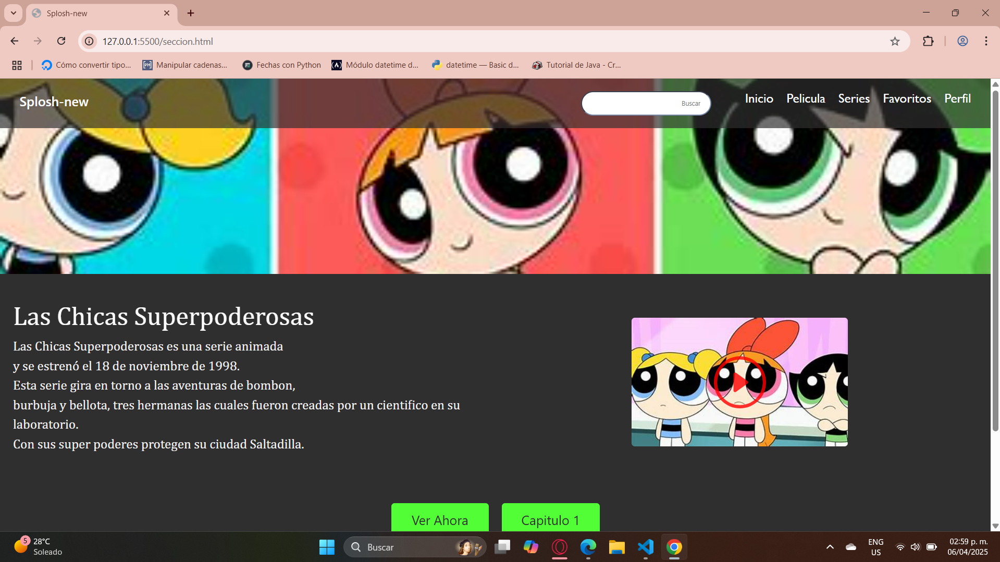
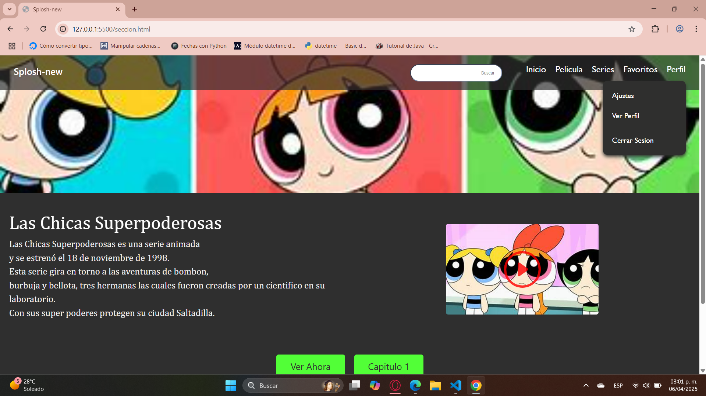
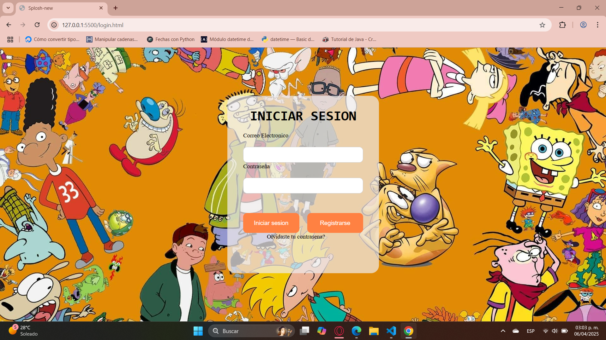

# splosh-new
El nombre de mi web app es "Splosh new"

Este es un sitio donde uno puede ver ya sean peliculas y series. 
Este tipo de contenido va para todas las edades, ya que contiene variedad de entretenimiento. 
Decidi hacer este sitio de series y peliculas antiguos que pasaban en la TV entre los 90's y los 2000's, si bien 
ya existe disney donde podemos encontrar algunos programas y peliculas que tiene, no estan todos los que se veian 
cuando eramos niños. 
Además que aun no hay una plataforma donde podamos encontrar los tres programas de televisión que antes se veían, como son 
nickelooden, disney, disney xd y cartoon network. 
Este sitio es para recordar las series de nuestra infancia, divertirnos y pasarla agusto. 

Este sitio tu puedes elegir que deseas ver y es muy facil de entender para el usuario, asi como facil de manipular. 

Este proyecto mas que nada es muy facil de usar. 
El login solo funciona la opcion de iniciar sesión. 
Lo demas campos o botones se ven como si tuvieran funcionalidad, pero no hacen nada aún, se deben de programar, pero por ahorita solo funciona el boton de inciar sesión, el cual te direciona al index, que es la pagina principal para mí, en donde ya esta tu inicio y te muestra varias opciones de ver series, tus favorios, remendados, lo mas nuevo. 
Puedes ver las opciones que tiene cada una de estas, son estaticas y no te direccionan a otro lado, excepto la de las chicas super poderosas, esa al darle click si te direcciona a otra pestaña en donde te da una breve descripción de la serie y es un prototipo de lo que se podria mostrar a la hora de darle click al ver la serie. 
Los botones y la imagen que aparece tampoco tiene alguna funcionalidad, pero esta se puede agregar con el tiempo. 
Las opciones del navbar no funcionan tampoco, solo el de perfil, que te despliega otro menu, en el cual la unica opcion que sirve es el cerrar sesión, que te direcciona al login para volver a iniciar la sesión. 
Tambien en la pestaña de las chicas super poderosas aparece otra opción en el navbar que es el Inicio, esta opción tambien funciona, te devuelve al index de este sitio. 

Para usar este repo es muy intuitivo, una vez descargado solo necesitas abrir el proyecto, verlo en tu navegador. 
Como no es necesario llenar los datos para iniciar la sesión con solo dar click en el boton de iniciar sesión te direcciona al home del proyecto. 
Ya tu puedes ver el contenido de la pagina, el unico que te direcciona tambien a otro contenido es el de las chicas super poderosas y en el navbar puede regresar al inicio o cerrar sesión y volver al login. 

Primero para hacer esta pagina hice la maquetación para saber como la queria, tenía la idea pero debía centrarla. 
Queria hacer algo en donde estuvieran todos los programas que veía de niñas, de varias producciones de televisón. 
Una vez hecho esto busque las imagenes que queria que aparecieran y ya con la maquetación empece la codificación, creando el login, despues el index y por ultimo una opcion de ver algo, que en este caso fue el de las chicas super poderosa. 

Los problemas fueron los estilos, no fue complicado, pero si es lo que al principio se complica, de que se vea como uno quiere, pero de ahí en más fue estuvo bien. 

Me hubiera encantado poder hacer más cosas en este proyecto, que si seleccionaras cualquier serie que se muetre te direccione a algo y que vengan varios episodios y quisas que se viera un video, meterle más producción y más funcionalidades. 
Un poco cambiarle el diseño, siento que esta muy simple. 
Si me hubiera encantado hacer algo más producido y funcionalidad a todo. 